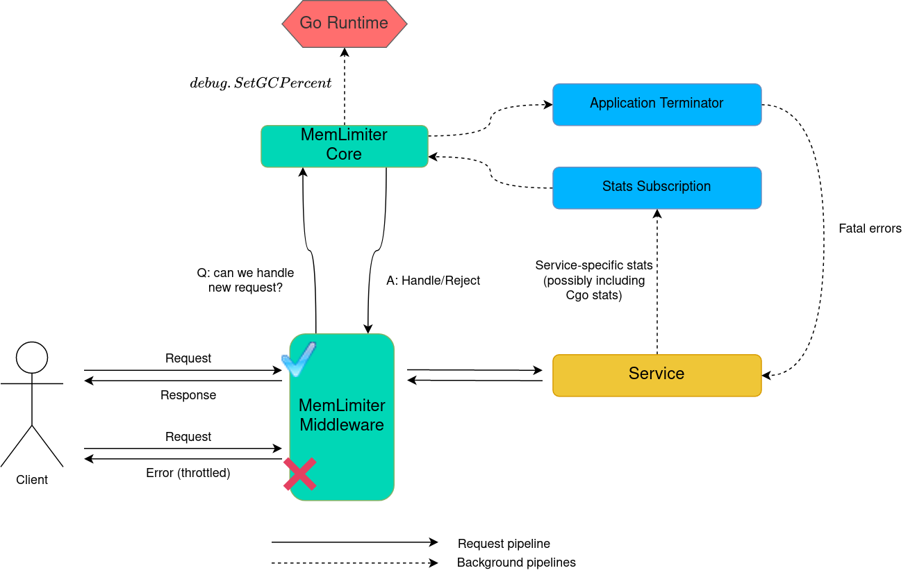
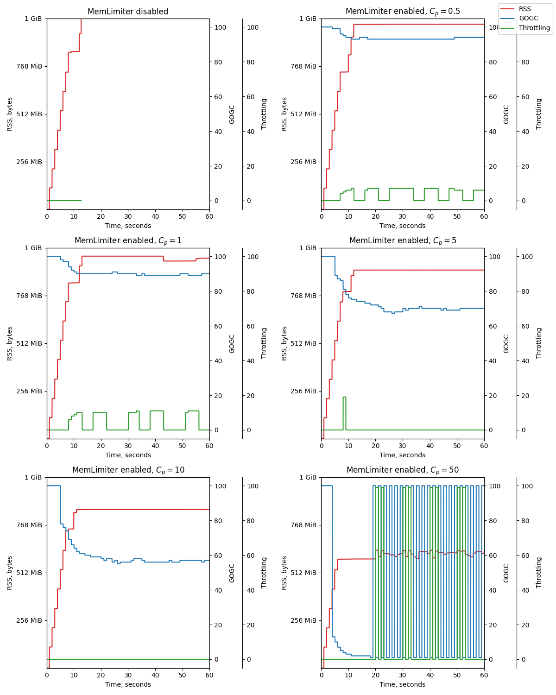
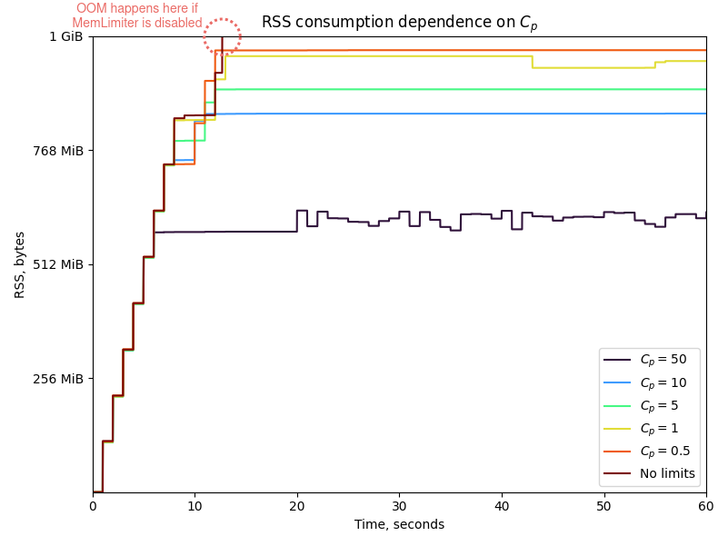

# MemLimiter

Library that helps to limit memory consumption of your Go service.

Notice: All APIs in this package are experimental and may be removed in a
later release.

## Working principles
As of today (Go 1.18), there is a possibility for any Go application to be eventually stopped by OOM killer. The memory leak is because Go runtime knows nothing about the limitations imposed on the process by the operating system (for instance, using `cgroups`). However, an unexpected termination of a process because of OOM is highly undesirable, as it can lead to cache resetting, data integrity violation, distributed transaction hanging and even cascading failure of a distributed backend. Therefore, services should degrade gracefully instead of immediate stop due to `SIGKILL`.

A universal solution for programming languages with automatic memory management comprises two parts:

1. **Garbage collection intensification**. The more often GC starts, the more garbage will be collected, the fewer new physical memory allocations we have to make for the service’s business logic.
2. **Request throttling**. By suppressing some of the incoming requests, we implement the backpressure: the middleware simply cuts off part of the load coming from the client in order to avoid too many memory allocations.

MemLimiter represents a memory budget [automated control system](https://en.wikipedia.org/wiki/Control_system) that helps to keep the memory consumption of a Go service within a predefined limit. 

### Memory budget utilization

The core of the MemLimiter is a special object quite similar to [P-controller](https://en.wikipedia.org/wiki/PID_controller), but with certain specifics (more on that below). Memory budget utilization value acts as an input signal for the controller. We define the $Utilization$ as follows:
$$ Utilization = \frac {NextGC} {RSS_{limit} - CGO} $$
where:
* $NextGC$ ([from here](https://pkg.go.dev/runtime#MemStats)) is a target size for heap, upon reaching which the Go runtime will launch the GC next time;
* $RSS_{limit}$ is a hard limit for service's physical memory (`RSS`) consumption (so that exceeding this limit will highly likely result in OOM);
* $CGO$ is a total size of heap allocations made beyond `Cgo` borders (within `C`/`C++`/.... libraries).

A few notes about $CGO$ component. Allocations made outside of the Go allocator, of course, are not controlled by the Go runtime in any way. At the same time, the memory consumption limit is common for both Go and non-Go allocators. Therefore, if non-Go allocations grow, all we can do is shrink the memory budget for Go allocations (which is why we subtract $CGO$ from the denominator of the previous expression). If your service uses `Cgo`, you need to figure out how much memory is allocated “on the other side” – **otherwise MemLimiter won’t be able to save your service from OOM**.

If the service doesn't use `Cgo`, the $Utilization$ formula is simplified to:
$$Utilization = \frac {NextGC} {RSS_{limit}}$$

### Control function

The controller converts the input signal into the control signal according to the following formula:

$$  K_{p} = C_{p} \cdot \frac {1} {1 - Utilization} $$

This is not an ordinary definition for a proportional component of the PID-controller, but still the direct proportionality is preserved: the closer the $Utilization$ is to 1 (or 100%), the higher the control signal value. The main purpose of the controller is to prevent a situation in which the next GC launch will be scheduled when the memory consumption exceeds the hard limit (and this will cause OOM).

You can adjust the proportional component control signal strength using a coefficient $C_{p}$. In addition, there is optional [exponential averaging](https://en.wikipedia.org/wiki/Moving_average#Exponential_moving_average) of the control signal. This helps to smooth out high-frequency fluctuations of the control signal (but it hardly eliminates [self-oscillations](https://en.wikipedia.org/wiki/Self-oscillation)).

The control signal is always saturated to prevent extremal values:

$$ Output = \begin{cases}
\displaystyle 100 \ \ \ K_{p} \gt 100 \\
\displaystyle 0 \ \ \ \ \ \ \ K_{p} \lt 100 \\
\displaystyle K_{p} \ \ \ \ otherwise \\
\end{cases}$$

Finally we convert the dimensionless quantity $Output$ into specific $GOGC$ (for the further use in [`debug.SetGCPercent`](https://pkg.go.dev/runtime/debug#SetGCPercent)) and $Throttling$ (percentage of suppressed requests) values, however, only if the $Utilization$ exceeds the specified limits:

$$ GC = \begin{cases}
\displaystyle Output \ \ \ Utilization \gt DangerZoneGC \\
\displaystyle 100 \ \ \ \ \ \ \ \ \ \ otherwise \\
\end{cases}$$

$$ Throttling = \begin{cases}
\displaystyle Output \ \ \ Utilization \gt DangerZoneThrottling \\
\displaystyle 0 \ \ \ \ \ \ \ \ \ \ \ \ \ \ otherwise \\
\end{cases}$$

## Architecture

The MemLimiter comprises two main parts:

1. **Core** implementing the memory budget controller and backpressure subsystems. Core relies on actual statistics provided by `stats.ServiceStatsSubscription`. In a critical situation, core may gracefully terminate the application with `utils.ApplicationTerminator`.
2. **Middleware** providing request throttling feature for various web frameworks. Every time the server receives a request, it uses middleware to ask the MemLimiter’s core for permission to process this request. Currently, only `GRPC` is supported, but `Middleware` is an easily extensible interface, and PRs are welcome.

## Quick start guide

### Services without `Cgo`

Refer to the [example service](test/allocator/server/server.go).

### Services with `Cgo`

Refer to the [example service](test/allocator/server/server.go).

You must also provide your own `stats.ServiceStatsSubscription` and `stats.ServiceStats` implementations. The latter one must return non-nil `stats.ConsumptionReport` instances if you want MemLimiter to consider allocations made outside of Go runtime allocator and estimate memory utilization correctly.

### Tuning

There are several key settings in MemLimiter [configuration](controller/nextgc/config.go):

* `RSSLimit`
* `DangerZoneGC` 
* `DangerZoneThrottling` 
* `Period`
* `WindowSize`
* `Coefficient` ($C_{p}$)

You have to pick them empirically for your service. The settings must correspond to the business logic features of a particular service and to the workload expected.

We made a series of performance tests with [Allocator][test/allocator] - an example service which does nothing but allocations that reside in memory for some time. We used different settings, applied the same load and tracked the RSS of a process.

Settings ranges:
* $RSS_{limit} = {1G}$
* $DangerZoneGC = 50%$
* $DangerZoneThrottling = 90%$
* $Period = 100ms$
* $WindowSize = 20$
* $C_{p} \in \\{0, 0.5, 1, 5, 10, 50, 100\\}$

These plots may give you some inspiration on how $C_{p}$ value affects the physical memory consumption other things being equal:

And the summary plot with RSS consumption dependence on $C_{p}$ value:

The general conclusion is that:
* The higher the $C_{p}$ is, the lower the $RSS$ consumption.
* Too low and too high $C_{p}$ values cause self-oscillation of control parameters.
* Disabling MemLimiter causes OOM.

## TODO

* Extend middleware.Middleware to support more frameworks.
* Add GOGC limitations to prevent death spirals.
* Add generic backpressure interface to let application make their own decisions in case if memory's exhausted.
* Support popular Cgo allocators like Jemalloc or TCMalloc, parse their stats to provide information about Cgo memory consumption.

Your PRs are welcome!
